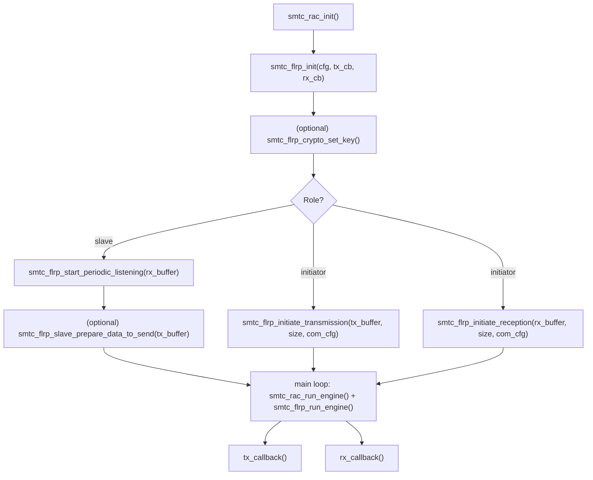

# SMTC FLRC Protocol API

This FLRP API documentation describes
- the common FLRP API functions,
- the specific FLRP-BURST API functions.

For the concepts and the tuning / limitations, see
[FLRP-BURST — Principles](../../../doc/FLRP_principles.md) and
[FLRP-BURST — Guidelines](../../../doc/FLRP_guidelines.md).

## Getting started

Minimal FLRP application (annotated skeleton):

```c
#include "smtc_flrp_api.h"
#include "smtc_flrp_crypto.h"   // only if you override the MIC key
#include "smtc_rac_api.h"

// Buffers MUST stay valid from the API call until the matching callback fires
// (use static/global storage, never the stack).
static uint8_t rx_buffer[MY_PAYLOAD_SIZE];
static uint8_t tx_buffer[MY_PAYLOAD_SIZE];

static void tx_callback( const void* ctx, smtc_flrp_return_code_t status,
                         bool send_successful, uint8_t* dest_addr )
{
    // TX exchange finished. Keep it short & non-blocking (runs in engine context).
}

static void rx_callback( const void* ctx, smtc_flrp_return_code_t status,
                         uint32_t payload_size, uint8_t* src_addr,
                         smtc_flrp_rx_stats_t stats )
{
    // On success, the received data is in the buffer you provided (rx_buffer).
    // `stats` is only valid when status == SMTC_FLRP_RC_OK.
}

int main( void )
{
    smtc_rac_init();
    smtc_flrp_api_config_t cfg = {
        .dev_eui        = { 0x00, 0x01, 0x02, 0x03, 0x04, 0x05, 0x06, 0x07 },
        .crypto_enabled = true,                 // MIC (AES-CMAC) replaces the radio CRC
        .freq_plan      = SMTC_FLRP_FREQ_865MHz,
        .crystal_error  = 30,                   // local clock accuracy, ppm
    };
    smtc_flrp_init( cfg, tx_callback, rx_callback, NULL );

    // Optional: override the default MIC key (flrc_default_key). Both devices must match.
    // smtc_flrp_crypto_set_key( SMTC_SE_APP_KEY, my_key, 0 );

    // Slave: start listening for an initiator.
    smtc_flrp_start_periodic_listening( rx_buffer, sizeof( rx_buffer ) );

    while( 1 )
    {
        smtc_rac_run_engine( );    // radio scheduler
        smtc_flrp_run_engine( );   // FLRP protocol engine

        if( ( smtc_flrp_call_run( ) == false ) && ( smtc_rac_is_irq_flag_pending( ) == false ) )
        {
            // Nothing time-critical pending -> the application may sleep here (WFI / semaphore).
        }

        // Initiator side (example): trigger a transfer when needed
        // smtc_flrp_com_config_t com = { .com_mode = SMTC_FLRP_BIDIRECTIONAL,
        //                                .slave_dev_eui = { ... },
        //                                .link_adaptation_mode = SMTC_FLRP_LINK_ADAPTATION_CHANNEL_SELECTION_ONLY };
        // smtc_flrp_initiate_transmission( tx_buffer, size, com );
    }
}
```

### Main loop

FLRP relies on **two engines** that must both be pumped regularly:

- `smtc_rac_run_engine()` — the Radio Access Controller scheduler (radio time management).
- `smtc_flrp_run_engine()` — the FLRP protocol state machine.

Two helpers let you sleep efficiently between events:

- `smtc_flrp_call_run()` returns `true` when FLRP has a **time-critical** action pending (open an RX
  window, send a frame) and therefore needs `smtc_flrp_run_engine()` to be called soon.
- `smtc_rac_is_irq_flag_pending()` returns `true` when a radio IRQ still has to be processed.

When **both are `false`**, nothing is pending: the application may enter low power (WFI / wait on a
semaphore) until the next event (user action, periodic timer, radio IRQ).

### API call flow



## Initialization of the FLRC protocol

Call `smtc_flrp_init()` with the parameters :
  - device ID, if the crypto is used (MIC added for every packets instead of a radio CRC), the frequency plan and the crystal error (`crystal_error`, the local clock accuracy in ppm, used to detect and compensate the frequency drift during the burst) in the structure `smtc_flrp_api_config_t`
  - tx_callback : the callback for all TX transmissions returning the user_context, the tx function error (stack error during the transmision),  if the transfert was successful and the destination device ID.
  - rx_callback : the callback for all RX transmissions returning the user_context, the rx function error (stack error during the reception), the size of the data received, the source device ID and the statistics of reception (not valid in case of error).
  - user_context : user context returned in the callbacks

The initialization configures defaults radio parameters accessible with the function `smtc_flrp_get_current_radio_config()`. The configuration `smtc_flrp_radio_config_t` can be updated after the initialization with `smtc_flrp_set_new_radio_config()`.
In this configuration, modulation parameters can be changed but also the delays between frames and the number of packet loss accepted.

## How to start listening periodically to an initiator

1. Call `smtc_flrp_init()`
2. Call `smtc_flrp_start_periodic_listening()` to start listening to an initiator periodically, with the pointer and size of the buffer of reception. The rx_callback will be called if the device has successfully received data from the initiator or if a stack error occured in the process.
3. Call `smtc_flrp_run_engine()` in a while loop to run the FLRC protocol API.
4. Call `smtc_flrp_slave_prepare_data_to_send()` if you want to send data to the initiator. The tx_callback will be called when an initiator ask the device to send its data. This data will be sent when a initiator request it until it is unset by calling the function with a payload_size of 0 or if a new payload is set.
When no data is configured, the slave will inform the initiator initiating the reception that it has no data to send.

To stop the periodic listening, use `smtc_flrp_stop_periodic_listening()`.

## How to initiate a transmission or a reception

1. Call `smtc_flrp_init()`
2. Call `smtc_flrp_initiate_transmission()` or `smtc_flrp_initiate_reception()` with the pointer and size of the buffer to send or receive and the communication configuration.
In the communication configuration (`smtc_flrp_com_config_t`), you need to specify :
  - the communication mode (`com_mode`), one of:
    - `SMTC_FLRP_BIDIRECTIONAL` — standard exchange with burst ACK (retries on missing packets),
    - `SMTC_FLRP_BIDIRECTIONAL_STREAM` — bidirectional exchange but without burst ACK (not validated),
    - `SMTC_FLRP_COM_ONE_WAY` — one-way transfer, no WOR ACK expected (not validated).
    Note: `smtc_flrp_initiate_reception()` supports only `SMTC_FLRP_BIDIRECTIONAL`.
  - the device ID of the slave to address (`slave_dev_eui`)
  - the filter length of the device ID address (`filter_len`), used only in `SMTC_FLRP_COM_ONE_WAY` mode
  - the mode of the adaptive link configuration (`link_adaptation_mode`, see `smtc_flrp_link_adaptation_mode_t`)
3. Call `smtc_flrp_run_engine()` in a while loop to run the FLRC protocol API.

Note: A device can initiate a reception or a transmission when the slave periodic listening is active, the exchange initiated will have priority.

## Callbacks

Both callbacks are registered in `smtc_flrp_init()` and run in the **engine context** — keep them
**short and non-blocking**; defer heavy work to the main loop.

- **`tx_callback(context, status, send_successful, dest_addr)`** — a TX exchange has finished.
  - `status` : return code (`smtc_flrp_return_code_t`, see [Return codes](#return-codes)).
  - `send_successful` : `bool`, whether the transfer actually succeeded.
  - `dest_addr` : target DevEUI (`uint8_t*`).
- **`rx_callback(context, status, payload_size, src_addr, stats)`** — a message was received (or an
  error occurred).
  - `status` : return code (`smtc_flrp_return_code_t`, see [Return codes](#return-codes)).
  - On success the received data is in the **buffer you provided** (to
    `smtc_flrp_start_periodic_listening()` or `smtc_flrp_initiate_reception()`).
  - `payload_size` : number of bytes received (`uint32_t`).
  - `src_addr` : sender DevEUI (`uint8_t*`).
  - `stats` (`smtc_flrp_rx_stats_t`) — **only valid when `status == SMTC_FLRP_RC_OK`**; two groups:
    - `stats.burst` : `nb_packets_received_ok`, `nb_packets_check_error` (CRC/MIC), `nb_packets_received_nok`,
      `nb_packets_expected`, `payload_size_expected`, `rssi_mean`, `exchange_phase_success_mask`
      (per-phase success), `last_burst_missed_packets_bitfield` (missed-packet bitmap).
    - `stats.wor` : `rssi`, `snr` of the WOR / WOR ACK.
- `context` is the `user_context` pointer passed to `smtc_flrp_init()`.
- Most stack errors are returned directly by calling the api functions. The errors returned in these callbacks are triggered later when a transmission/reception is planned.

## Buffer lifetime

The TX and RX buffers are **not copied** by FLRP: they must stay **valid and unchanged** from the API
call until the matching callback fires.

- RX buffer passed to `smtc_flrp_start_periodic_listening()` / `smtc_flrp_initiate_reception()` → until
  `rx_callback`.
- TX buffer passed to `smtc_flrp_initiate_transmission()` / `smtc_flrp_slave_prepare_data_to_send()` →
  until `tx_callback`.

Use **static or global** buffers (never stack-local ones).

## Return codes

Every FLRP API function and the `status` argument of both callbacks return `smtc_flrp_return_code_t`.
**Output values / stats must not be read unless `status == SMTC_FLRP_RC_OK`.**

| Value | Meaning |
|-------|---------|
| `SMTC_FLRP_RC_OK` | Success |
| `SMTC_FLRP_RC_NOT_INIT` | Called before `smtc_flrp_init()` |
| `SMTC_FLRP_RC_BUSY` | Exchange in progress or radio busy |
| `SMTC_FLRP_RC_INVALID_PARAMS` | Parameter out of range or inconsistent |
| `SMTC_FLRP_RC_UNSUPPORTED_FEATURE` | Feature not available in this build |
| `SMTC_FLRP_RC_ERROR` | Unspecified error |

## Troubleshooting

| Symptom | Likely cause | Fix |
|---------|--------------|-----|
| Packets missed **at the end of the burst** | - clock error > ~60 ppm (drift accumulates, no per-packet resync)<br>- Inter-frame not properly set | - set `crystal_error` correctly; use a TCXO; shorten frames / lower datarate — see *Guidelines → Clock accuracy*<br>- Measure Interframe on the specific MCU |
| Packet loss / poor sensitivity, especially at **CR 3/4** | PA ramp time and interframe too short / not paired | pair them (128 µs ↔ 400 µs, 272 µs ↔ 700 µs) — see *Guidelines → Packet loss vs. interframe* |
| FLRC packets not correctly transferred during **Phase 3 (Data Transfer)** | the **interframe** differs between transmitter and receiver (different MCU processing time / SPI speed) | make the interframe **comparable** on both ends: prefer the **same device type** for the initiator and the slave; if they differ, validate that the transmitter's **SPI speed and MCU processing** are consistent with the receiver's |
| Systematic **MIC errors** on RX | the two devices use different keys | set the same key via `smtc_flrp_crypto_set_key(SMTC_SE_APP_KEY, key, 0)` |
| `smtc_flrp_initiate_reception()` fails with broadcast / one-way | reception supports only `SMTC_FLRP_BIDIRECTIONAL` | use `SMTC_FLRP_BIDIRECTIONAL` for reception |
| Truncated / never-completing transfer with **adaptive link disabled** (`SMTC_FLRP_LINK_ADAPTATION_DISABLED`) or lots of PER errors | no FLRC REQ/ACK ⇒ payload size not signalled, or the two radio configs differ (e.g. **different frequency/channel configuration** on the two devices) | on both sides use the **same** radio config (incl. frequencies/channels) and make the **RX buffer size equal the transmitted payload size**, or re-enable the adaptive link |
| `rx_callback()` or `tx_callback` with status SMTC_FLRP_RC_ERROR | The protocol delays set in `smtc_flrp_flrc_radio_config_t` are not appropriate / the radio configuration set with `smtc_flrp_set_new_radio_config()` is invalid | increase the protocol delays (max 25ms) and check the WOR/FLRC radio parameters set |
| `rx_callback()` or `tx_callback`  with status SMTC_FLRP_RC_INVALID_PARAMS | The buffer size is incorrect | set the size to maximum 16777215 bytes |

## Notes

- The protocol engine is run with `smtc_flrp_run_engine()`. `smtc_flrp_call_run()` returns `true` when the protocol has a time-critical operation pending (e.g. opening a reception window or sending a frame) and therefore needs `smtc_flrp_run_engine()` to be called — use it to schedule the engine efficiently.
- We do not guarantee that the exchanges would work with different MCU on RX and TX sides. In this release, the processing time of the devices needs to be the same due to the interframe delay.
Indeed the interframe delay in `smtc_flrp_radio_config_t` is the delay observed for the MCU to compute the time on air and not a delay to impose to the MCU. If the interframe delays are too distant, packets will be missed.
- The size max of data to transmit is 16777215 bytes (value transmitted on 3 bytes).
