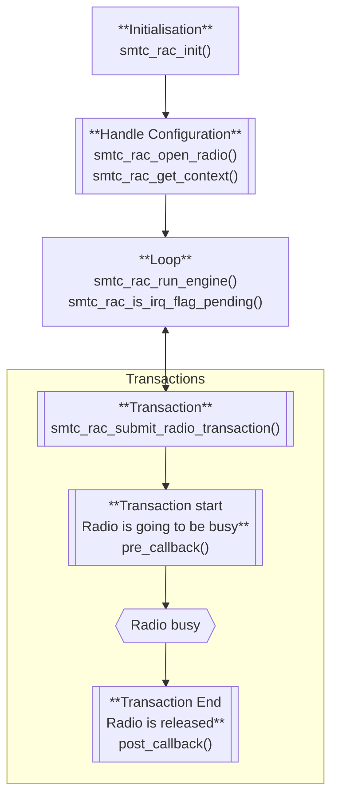

# USP API

This library provides an abstraction layer for scheduling and managing radio access for LoRa and ranging operations, using Semtech's radio planner. It allows applications to request radio access, configure LoRa transmissions and receptions, and schedule radio operations with different priorities.

## Features

- Priority-based radio access management
- Multi-modulation support: LoRa, FSK, LR-FHSS, and FLRC
- LoRa transmission, reception, and ranging support
- Scheduling of radio operations
- Callback support for asynchronous operations
- Integration with Semtech's radio planner

## Data Structures

### `smtc_rac_context_t`
Aggregates all parameters for a radio operation:
- `modulation_type`: Type of modulation (LoRa, FSK, LR-FHSS, or FLRC)
- `radio_params`: Union containing modulation-specific parameters (lora, fsk, lrfhss, flrc)
- `smtc_rac_data_buffer_setup`: Data buffer setup for the transaction
- `scheduler_config`: Scheduling and callback configuration
- `smtc_rac_data_result`: Data results from the transaction
- `lbt_context`: LBT context for Listen Before Talk operations (optional)
- `cad_context`: CAD context for Channel Activity Detection operations (optional)
- `cw_context`: CW context for Continuous Wave operations (optional)
Due to the constraints on `smtc_rac_data_buffer_setup`, this struct must be persistent between `smtc_rac_submit_radio_transaction()` and the post transaction callback.

### `smtc_rac_modulation_type_t`
Modulation types supported by RAC:
- `SMTC_RAC_MODULATION_LORA` - LoRa modulation
- `SMTC_RAC_MODULATION_FSK` - FSK/GFSK modulation
- `SMTC_RAC_MODULATION_LRFHSS` - LR-FHSS modulation
- `SMTC_RAC_MODULATION_FLRC` - FLRC modulation

### `smtc_rac_data_buffer_setup_t`
Data buffer setup for a radio operation:
- `tx_payload_buffer`: Pointer to transmission payload buffer
- `size_of_tx_payload_buffer`: Size of TX buffer in bytes
- `rx_payload_buffer`: Pointer to reception payload buffer
- `size_of_rx_payload_buffer`: Size of RX buffer in bytes
This struct must still be valid when the post transaction callback is invoked.
Must be persistent between `smtc_rac_submit_radio_transaction()` and the post transaction callback.

### `smtc_rac_radio_lora_params_t`
Configuration for a LoRa radio operation:
- `is_tx`: Set to true for transmission, false for reception
- `is_ranging_exchange`: Set to true for ranging operations
- `rttof`: Ranging-specific parameters
- `frequency_in_hz`: Frequency in Hz
- `tx_power_in_dbm`: Transmission power in dBm
- `sf`, `bw`, `cr`: LoRa modulation parameters
- `preamble_len_in_symb`: Preamble length
- `header_type`: Packet header type
- `invert_iq_is_on`, `crc_is_on`: Enable/disable IQ inversion and CRC
- `sync_word`: LoRa sync word
- `tx_size`: Size of TX payload to transmit in bytes
- `rx_timeout_ms`: RX timeout in ms
- `symb_nb_timeout`: Number of symbols to wait for the preamble (RX only)
- `max_rx_size`: Maximum size of RX payload buffer in bytes (the radio will stop RX after max_rx_size)


### `smtc_rac_radio_fsk_params_t`
Configuration for a FSK radio operation:
- `is_tx`: Set to true for transmission, false for reception
- `tx_size`: Size of TX payload in bytes
- `max_rx_size`: Maximum size of RX payload buffer in bytes
- `frequency_in_hz`: Frequency in Hz
- `tx_power_in_dbm`: Transmission power in dBm
- `br_in_bps`: Bit rate in bits per second
- `fdev_in_hz`: Frequency deviation in Hz
- `bw_dsb_in_hz`: Bandwidth (double-sided) in Hz
- `pulse_shape`: Pulse shaping filter
- `header_type`: Packet header type (fixed or variable length)
- `preamble_len_in_bits`: Length of the preamble in bits
- `sync_word`, `sync_word_len_in_bits`: Synchronization word and its length
- `crc_type`, `crc_seed`, `crc_polynomial`: CRC configuration
- `rx_timeout_ms`: RX timeout in ms

### `smtc_rac_radio_lrfhss_params_t`
Configuration for a LR-FHSS radio operation (transmission only):
- `is_tx`: Must be true (LR-FHSS is transmission-only)
- `tx_size`: Size of TX payload in bytes
- `frequency_in_hz`: Center frequency in Hz
- `tx_power_in_dbm`: Transmission power in dBm
- `coding_rate`: Coding rate for LR-FHSS modulation
- `bandwidth`: Bandwidth for LR-FHSS modulation
- `grid`: Grid step for frequency hopping
- `enable_hopping`: Enable frequency hopping
- `sync_word`: Synchronization word (4 bytes)

### `smtc_rac_radio_flrc_params_t`
Configuration for a FLRC radio operation:
- `is_tx`: Set to true for transmission, false for reception
- `tx_size`: Size of TX payload in bytes
- `max_rx_size`: Maximum size of RX payload buffer in bytes
- `frequency_in_hz`: Frequency in Hz
- `tx_power_in_dbm`: Transmission power in dBm
- `br_in_bps`: Bit rate in bits per second
- `bw_dsb_in_hz`: Bandwidth (double-sided) in Hz
- `cr`: Coding rate
- `pulse_shape`: Pulse shaping filter
- `preamble_len_in_bits`: Length of the preamble in bits
- `sync_word_len`, `tx_syncword`, `match_sync_word`: Synchronization configuration
- `pld_is_fix`: Fixed (true) or variable (false) length
- `crc_type`, `crc_seed`, `crc_polynomial`: CRC configuration
- `rx_timeout_ms`: RX timeout in ms

### `smtc_rac_scheduler_config_t`
Scheduling configuration:
- `start_time_ms`: Scheduled start time (ms)
- `duration_time_ms`: Duration time in milliseconds
- `scheduling`: Scheduling mode (SMTC_RAC_SCHEDULED_TRANSACTION or SMTC_RAC_ASAP_TRANSACTION)
- `callback_pre_radio_transaction`: Callback called just before radio transaction
- `callback_post_radio_transaction`: Callback called just after radio transaction with rp_status_t parameter

### `smtc_rac_data_result_t`
Data results from a radio operation:
- `rx_size`: Size of received payload in bytes
- `rssi_result`: Received Signal Strength Indicator (RSSI) value
- `snr_result`: Signal-to-Noise Ratio (SNR) value
- `radio_end_timestamp_ms`: Timestamp of radio event end
- `radio_start_timestamp_ms`: Timestamp of radio event start
- `ranging_result`: Ranging result structure (for RTToF)

## Typical RAC Types

### `smtc_rac_priority_t`
Defines the priority for radio access requests:
- `RAC_VERY_HIGH_PRIORITY`
- `RAC_HIGH_PRIORITY`
- `RAC_MEDIUM_PRIORITY`
- `RAC_LOW_PRIORITY`
- `RAC_VERY_LOW_PRIORITY`

### `smtc_rac_return_code_t`
Return codes for API functions:
- `SMTC_RAC_SUCCESS`
- `SMTC_RAC_ERROR`
- `SMTC_RAC_BUSY`
- `SMTC_RAC_TIMEOUT`
- `SMTC_RAC_INVALID_PARAMETER`
- `SMTC_RAC_NOT_SUPPORTED`
- `SMTC_RAC_NOT_INITIALIZED`
- `SMTC_RAC_NOT_IMPLEMENTED`

### `rp_status_t` Values
The `callback_post_radio_transaction` receives an `rp_status_t` parameter indicating the result of the radio operation:
- `RP_STATUS_RX_CRC_ERROR`: RX packet received with CRC error
- `RP_STATUS_CAD_POSITIVE`: Channel Activity Detection detected activity
- `RP_STATUS_CAD_NEGATIVE`: Channel Activity Detection detected no activity
- `RP_STATUS_TX_DONE`: Transmission completed successfully
- `RP_STATUS_RX_PACKET`: RX packet received successfully
- `RP_STATUS_RX_TIMEOUT`: RX operation timed out
- `RP_STATUS_LBT_FREE_CHANNEL`: Listen Before Talk detected free channel
- `RP_STATUS_LBT_BUSY_CHANNEL`: Listen Before Talk detected busy channel
- `RP_STATUS_WIFI_SCAN_DONE`: WiFi scan operation completed
- `RP_STATUS_GNSS_SCAN_DONE`: GNSS scan operation completed
- `RP_STATUS_TASK_ABORTED`: Radio task was aborted
- `RP_STATUS_TASK_INIT`: Radio task initialization
- `RP_STATUS_LR_FHSS_HOP`: LR-FHSS frequency hop occurred
- `RP_STATUS_RTTOF_REQ_DISCARDED`: RTToF request was discarded
- `RP_STATUS_RTTOF_RESP_DONE`: RTToF response completed
- `RP_STATUS_RTTOF_EXCH_VALID`: RTToF exchange was valid
- `RP_STATUS_RTTOF_TIMEOUT`: RTToF operation timed out


## API Functions

### `void smtc_rac_init(void);`
Initializes the RAC. Must be called before any other API function.

### `void smtc_rac_run_engine(void);`
Runs the RAC  engine. Should be called regularly to process scheduled operations.

### `bool smtc_rac_is_irq_flag_pending(void);`
Checks if a radio IRQ is pending.

### `radio_planner_t *smtc_rac_get_rp(void);`
Returns a pointer to the internal radio planner instance.

### `uint8_t smtc_rac_open_radio(smtc_rac_priority_t priority);`
Requests radio access with a given priority. Returns a radio access ID.

### `smtc_rac_return_code_t smtc_rac_submit_radio_transaction(uint8_t radio_access_id);`
Submits a radio transaction for execution by the radio planner using the specified radio access ID.

### `smtc_rac_return_code_t smtc_rac_close_radio(uint8_t radio_access_id);`
Closes the radio access and releases resources associated with the given radio access ID.

### `smtc_rac_return_code_t smtc_rac_abort_radio_submit(uint8_t radio_access_id);`
Aborts a pending radio request associated with the given radio access ID.

### `smtc_rac_context_t *smtc_rac_get_context(uint8_t radio_access_id);`
Gets the RAC context for a specific radio access ID. Use this to configure radio parameters before submitting a transaction.

### `smtc_rac_return_code_t smtc_rac_lora(uint8_t radio_access_id);`
Enqueue a LoRa or ranging task for execution by the radio planner.

### `smtc_rac_return_code_t smtc_rac_fsk(uint8_t radio_access_id);`
Enqueue a FSK task for execution by the radio planner.

### `smtc_rac_return_code_t smtc_rac_lrfhss(uint8_t radio_access_id);`
Enqueue a LR-FHSS transmission task for execution by the radio planner. Note: LR-FHSS is transmission-only.

### `smtc_rac_return_code_t smtc_rac_flrc(uint8_t radio_access_id);`
Enqueue a FLRC task for execution by the radio planner.

## API Workflow




## Example Usage

```c
// Callback functions
void my_pre_callback(void) {
    // Called just before radio transaction starts
    LOG("Radio transaction starting...\n");
}

void my_post_callback(rp_status_t status) {
    // Called just after radio transaction completes
    LOG("Radio transaction completed with status: %d\n", status);
    if (status == RP_STATUS_TX_DONE) {
        LOG("Transmission successful!\n");
    } else if (status == RP_STATUS_RX_PACKET) {
        LOG("Packet received!\n");
    }
}

// Initialize RAC
smtc_rac_init();

// Request radio access
uint8_t radio_id = smtc_rac_open_radio(RAC_HIGH_PRIORITY);

// Get context and configure parameters
smtc_rac_context_t *ctx = smtc_rac_get_context(radio_id);
ctx->modulation_type = SMTC_RAC_MODULATION_LORA;
ctx->radio_params.lora.is_tx = true;
ctx->radio_params.lora.frequency_in_hz = 868100000;
ctx->radio_params.lora.tx_power_in_dbm = 14;
ctx->radio_params.lora.tx_size = payload_size; // This is the size of payload to transmit from the tx_payload_buffer
ctx->radio_params.lora.sf = RAL_LORA_SF7;
ctx->radio_params.lora.bw = RAL_LORA_BW_125_KHZ;
ctx->radio_params.lora.cr = RAL_LORA_CR_4_5;
ctx->smtc_rac_data_buffer_setup.tx_payload_buffer = payload_buffer;
ctx->smtc_rac_data_buffer_setup.size_of_tx_payload_buffer = sizeof(payload_buffer); // This is the size of the tx_payload_buffer
ctx->scheduler_config.scheduling = SMTC_RAC_ASAP_TRANSACTION;
ctx->scheduler_config.callback_pre_radio_transaction = my_pre_callback;
ctx->scheduler_config.callback_post_radio_transaction = my_post_callback;

// Submit the operation
smtc_rac_return_code_t result = smtc_rac_submit_radio_transaction(radio_id);

// In main loop
while (1) {
    smtc_rac_run_engine();
}
```

For more details, see the header files [`smtc_rac_api.h`](smtc_rac_api/smtc_rac_api.h) & [`smtc_rac.h`](smtc_rac/smtc_rac.h).

